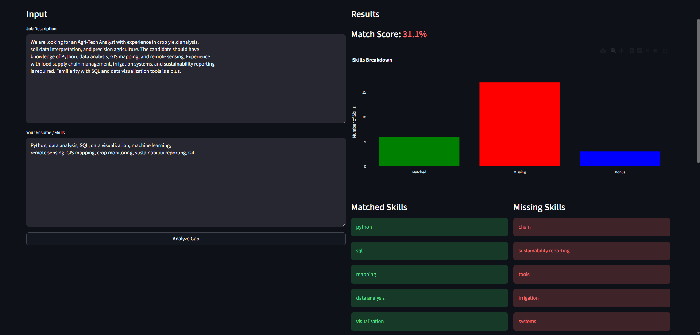

# Job Skills Gap Analyzer

A web app that analyzes the gap between a job description and a candidate's resume, 
producing a match score, visual skills breakdown, and personalized learning recommendations.

Live Demo: https://job-skills-gap-analyzer-fsjrvdqmixcgkvxjl9ewmo.streamlit.app/

## Problem Statement

Job seekers often apply to roles without knowing exactly what skills they're missing. 
This tool extracts skills from both a job description and a resume, compares them using 
TF-IDF cosine similarity, and tells the user what to learn next.

## How It Works

- Paste a job description on the left
- Paste your resume or skills list on the right
- Click Analyze Gap
- Get a match score, matched skills, missing skills, bonus skills, and recommendations

## Results

The app produces:
- A match score from 0 to 100 percent
- Color coded skill breakdown (green matched, red missing, blue bonus)
- A bar chart visualization
- 3 personalized learning recommendations based on missing skills

## Study Discernment

- TF-IDF cosine similarity works well for keyword-heavy job descriptions
- Short or vague inputs produce lower accuracy results
- The known skills list covers common tech skills but may miss niche domain skills
- Future improvement: replace spaCy noun chunking with a fine-tuned NER model for skill extraction

## How to Run

pip install -r requirements.txt
python -m streamlit run app.py

## Built With

- Python
- Streamlit
- spaCy
- scikit-learn
- Plotly